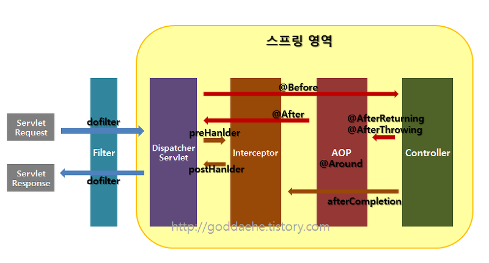

# Spring
- [Framework를 사용하는 이유](#framework를-사용하는-이유)
- [Library vs Framework](#library-vs-framework)
  - [Library](#library)
  - [Framework](#framework)
- [Web Server vs Web Application Server](#web-server-vs-web-application-server)
  - [Web Server](#web-server)
  - [Web Application Server](#web-application-server)
  - [Web Server와 WAS를 구분하는 이유](#web-server와-was를-구분하는-이유)
- [Servlet vs JSP](#servlet-vs-jsp)
  - [Servlet](#servlet)
  - [JSP](#jsp)
  - [Servlet과 JSP의 관계](#servlet과-jsp의-관계)
    - [JSP만 이용하는 모델](#jsp만-이용하는-모델)
    - [JSP와 Servlet을 모두 이용하는 모델](#jsp와-servlet을-모두-이용하는-모델)
- [Get vs Post](#get-vs-post)
- [Cookie vs Session](#cookie-vs-session)
  - [Cookie와 Session을 사용하는 이유](#cookie와-session을-사용하는-이유)
- [JDBC](#jdbc)
  - [Java에서 DB를 연결하는 방법](#java에서-db를-연결하는-방법)
- [Spring Framework](#spring-framework)
  - [Spring의 정의](#spring의-정의)
  - [Spring의 전략](#spring의-전략)
  - [Spring의 특징](#spring의-특징)
  - [Spring Framework의 기능요소](#spring-framework의-기능요소)
  - [Filter vs Interceptor vs AOP](#filter-vs-interceptor-vs-aop)
- [REST](#rest)
  - [RESTful](#restful)
  - [REST의 특징](#rest의-특징)
  - [REST의 구성](#rest의-구성)
  - [REST API 디자인 가이드](#rest-api-디자인-가이드)
  - [HTTP 응답 코드](#http-응답-코드)
- [JPA](#jpa)
  - [Hibernate](#hibernate)
  - [Spring Data JPA](#spring-data-jpa)
- [Spring Boot](#spring-boot)
  - [Spring Boot 장점](#spring-boot-장점)
  - [Spring Boot 단점](#spring-boot-단점)

## Framework를 사용하는 이유
소프트웨어의 설계와 구현에 있어서 **전체적인 뼈대와 틀을 제공**함으로써 개발자가 편하게 개발할 수 있게 해준다. 프레임워크의 사용으로 개발자는 비즈니스 로직에 집중함으로써 **생산성이 증가**하고 코드의 재사용성, 유지 보수성 그리고 확장성을 갖게 해줌으로서 **코트의 품질을 높여**준다.

## Library vs Framework
중요한 차이점은 **제어의 역전**이다.

### Library
- 클래스의 집합으로서 코드의 **재사용성을 지원**해 준다. (예를 들면 Math 함수)
- 제어의 주체는 **개발자 자신**으로 코드에서 라이브러리 함수를 호출하여 사용한다.

### Framework
- 제어의 주체가 **프레임워크**가 되어 프레임워크에서 우리의 코드를 호출한다. (IOC; Inversion of Control)
- 프레임워크에서 기본적인 뼈대를 잡아놓았기 때문에 우리는 **제어의 흐름에 맞게 코드를 작성**해 주면 프레임워크에서 그것에 맞게 호출한다.

## Web Server vs Web Application Server

### Web Server
- 웹 브라우저 클라이언트로부터 HTTP 요청을 받아 정적인 컨텐츠를 제공하는 컴퓨터 프로그램
- **정적인 컨텐츠**를 제공한다.
- WAS를 거치지 않고 **바로 자원을 제공**한다.
- Web Server에서는 정적 컨텐츠만 처리하도록 기능을 분배하여 **서버의 부담을 줄일 수 있다.**
- Ex) Apache Server, Nginx, IIS 등

### Web Application Server
- DB 조회나 다양한 로직 처리를 요구하는 **동적인 컨텐츠**를 제공하기 위해 만들어진 Application Server
- HTTP를 통해 컴퓨터나 장치에 애플리케이션을 수행해주는 미들웨어이다.
- WAS를 통해 요청에 맞는 데이터를 DB에서 가져와서 비즈니스 로직에 맞게 결과를 만들어 제공함으로써 **자원을 효율적으로 사용**할 수 있다.
- Ex) Tomcat, JBoss, Jeus 등

출처 : https://gmlwjd9405.github.io/2018/10/27/webserver-vs-was.html

### Web Server와 WAS를 구분하는 이유
- **서버의 자원을 효율적으로 사용하자** 에서 출발한다.
- 사용자가 원하는 요청에 대한 결과값을 모두 만들어놓고 서비스하기엔 절대적으로 **자원이 부족**하다.
- 클라이언트에게 이미지 파일과 같은 정적인 파일들을 보내줄 때, HTML 문서가 보내질 때 함께 가는 것이 아니고 클라이언트가 ***HTML 파일을 먼저 받고 그에 필요한 이미지 파일들을 다시 서버로 요청하면 그때 보내준다.***
- 이 때, 우리의 서버는 데이터베이스를 왔다갔다 하며 로직을 처리하기 바쁜데, 단순한 정적 파일을 브라우저에게 돌려주는 역할을 한다면 굉장히 비효율 적이다.
- 따라서 이 둘을 나누어 처리하면 더욱 **효율적으로 자원을 활용**할 수 있다.

출처 : https://dodo4513.github.io/2017/06/18/server_architecture/

## Servlet vs JSP
기능의 차이는 없고 역할의 차이만 있다.

### Servlet
- 웹 기반의 요청에 대한 동적인 처리가 가능한 Server Side에서 돌아가는 자바 프로그램
- **Java 코드** 안에 HTML 코드가 있다.
- **데이터 처리(Controller)** 에 좋다.
- 즉, DB와의 통신, Business Logic 호출, 데이터 읽고 확인하는 작업에 유용하다
- Servlet이 수정되면 Java 코드를 컴파일(.class 파일 생성)한 후 동적인 페이지를 처리하기 때문에 전체 코드를 업데이트하면 다시 컴파일한 후 재배포하는 작업이 필요하다. (**개발 생산성 저하**)

### JSP
- Java 언어를 기반으로 하는 Server Side 스크립트 언어
- **HTML 코드** 안에 Java 코드가 있다.
- **Presentation(View)** 에 좋다.
- 즉, 요청 결과를 나타내는 HTML을 작성하는데 유용하다.
- JSP가 수정된 경우 재배포할 필요가 없이 WAS가 알아서 처리한다. (배포가 쉽다)

### Servlet과 JSP의 관계

#### JSP만 이용하는 모델
- JSP가 사용자의 요청을 받아 Java Bean(DTO, DAO)을 호출하여 적절한 동적 페이지를 생성한다.
- 장점 : 개발 속도가 빠르고 배우기 쉽다.
- 단점 : View와 Controller가 혼재(디자인과 로직이 섞임)하여 코드가 복잡해져 **유지 보수가 어려워**진다.

#### JSP와 Servlet을 모두 이용하는 모델
- JSP와 Servlet을 모두 사용하여 View와 Controller를 분리한다.
- MVC architecture
  - **Model(Java Beans)** : 에플리케이션의 상태(데이터)를 나타낸다.
  - **View(JSP)** : 보여지는 부분을 책임진다.
  - **Controller(Servlet)** : Model과 View 사이의 **인터페이스 역할**을 한다.
- 장점 : 기능에 따라 코드가 분리되어 있기 때문에 **유지보수가 용이**하다.
- 단점 : 구조가 복잡하여 습득이 어렵고 작업량이 많다.

출처 : https://gmlwjd9405.github.io/2018/11/04/servlet-vs-jsp.html

## Get vs Post
- Get
  - 클라이언트에서 서버로 데이터를 전달할 때, 주소 뒤에 **주소명**과 **값**이 결합된 **스트링 형태로 전달**하는 방식이다.
  - 주소창에 쿼리 스트링이 그대로 보여지기 때문에 **보안성이 떨어진다**.
  - **길이에 제한**이 있다. (255개의 문자)
  - Post 방식보다 상대적으로 **전송 속도가 빠르다**.
  - 주로 웹 브라우저에서 웹 서버에 **데이터를 요청**할 때 사용한다.

- Post
  - 클라이언트에서 서버로 데이터를 전달할 때 데이터의 정보를 **Body 부분에 넣어 전달**하는 방식이다.
  - 주소창에 데이터의 정보가 노출되지 않아 **Get 방식에 비해 보안성이 높다**.
  - **많은 양의 데이터**를 보낼 수 있다.
  - Get 방식보다 **전송 속도가 느리다**.
  - 주로 웹 브라우저가 웹 서버에 **데이터를 전달**할 때 사용한다.

## Cookie vs Session
- Cookie
  - 쿠키에 관련된 데이터는 **사용자의 PC에 저장**되기 때문에 다른 사용자에 의해 임의로 변경이 가능하여 보안성이 낮다.

- Session
  - 세션에 관련된 데이터는 **서버에 저장**되기 때문에 쿠키에 비해 보안성이 좋다.

### Cookie와 Session을 사용하는 이유
현재 우리가 인터넷에서 사용하고 있는 HTTP 프로토콜은 **연결 지향적인 성격을 버렸기 때문에** 새로운 페이지를 요청할 때마다 새로운 접속이 이루어지며 이전 페이지와 현재 페이지 간의 **관계가 지속되지 않는다**. 이에 따라 HTTP 프로토콜을 이용하게 되는 웹 사이트에서는 웹 페이지에 특정 방문자가 머무르고 있는 동안에 그 **방문자의 상태를 지속시키기 위해** 쿠기와 세션을 이용한다. 그리고 **모든 정보를 세션에 저장하면 서버의 메모리를 과도하게 사용**하게 되기 때문에 둘 다 사용한다.

출처 : https://animal-park.tistory.com/8

## JDBC
- Java DataBase Connection의 약자로, Java 언어를 통해 데이터 베이스에 접근할 수 있는 프로그래밍이다.

### Java에서 DB를 연결하는 방법
- JDBC를 사용하는 방법
  - 사용자가 직접 소스 코드에 아이디, 비밀번호, IP 등을 입력하여 커넥션 객체를 생성하고 그 커넥션 객체를 이용하여 DB를 제어한다.
- Connection Pool을 사용하는 방법
  - 사용자가 직접 소스 코드를 통해 DB에 연결하는 것이 아니라, WAS가 하고 사용자는 WAS가 연결한 커넥션을 이용한다.

출처 : https://tychejin.tistory.com/32

## Spring Framework

### Spring의 정의
- IoC와 AOP를 지원하는 경량의 컨테이너 프레임워크

### Spring의 전략
- Portable Service Abstraction(서비스 추상화) : 기술적인 복잡함은 추상화를 통해 Low Level의 기술구현부분과 기술을 사용하는 **인터페이스로 분리**한다.
- DI(Dependency Injection) : 유연하게 **확장 가능한 객체**를 만들어 두고 그 관계는 외부에서 동적으로 설정해준다.
- AOP(Aspect Oriented Programming) : 애플리케이션 로직을 담당하는 코드에 남아있는 기술 관련 코드를 분리해서 **별도의 모듈로 관리**할 수 있게 해준다.
- POJO(Plain Old Java Object) : **객체지향 원리에 충실**하면서, 특정 환경이나 규약에 종속되지 않고 **필요에 따라 재활용될 수 있는 방식**으로 설계된 객체이다.

### Spring의 특징
- 경량 컨테이너로 **자바 객체를 직접 관리**한다.
- **제어의 역전**(IoC : Inversion of Control)을 지원하여 **필요에 따라 스프링에서 사용자의 코드를 호출**한다.
- **의존성 주입**(DI : Dependency Injection)을 지원하여 각각의 계층이나 서비스들 간에 **의존성이 존재할 경우 프레임워크가 서로 연결**해준다.
- **관점지향 프로그래밍**(AOP : Aspect Oriented Programming)으로 트랜잭션, 로깅, 보안과 같은 여러 모듈에서 **공통적으로 사용하는 기능을 분리하여 관리**한다.
- **POJO**(Plain Old Java Object) 방식의 프레임워크로 **기존에 존재하는 라이브러리의 지원이 용이**하다.
- **트랜잭션 처리를 위한 일관된 방법**을 지원
- **영속성과 관련된 다양한 서비스를 지원**하여 Mybatis, hibernate 등과 같은 데이터베이스 처리 라이브러리와 연결할 수 있는 인터페이스를 제공한다.
- **높은 확장성**을 갖는다.

### Spring Framework의 기능요소
- Spring Core : Spring 프레임워크의 기본기능을 제공한다. 이 모듈에 있는 BeanFactory는 Spring의 기본 컨테이너이면서 스프링 DI 기반이다.
- Spring Context : BeanFactory의 개념을 확장한 것으로 국제화 메시지, 애플리케이션 생명주기 이벤트, 유효성 검증을 지원한다.
- Spring DAO : JDBC에 대한 추상화 계층으로 JDBC 코딩이나 예외처리 하는 부분을 간편화 시켰으며, AOP 모듈을 이용해 트랜잭션 관리 서비스도 제공한다.
- Spring ORM : Mybatis, Hibernate, JPA 등 널리 사용되는 ORM 프레임워크와의 연결고리를 제공한다.
- Spring AOP : AOP 모듈을 통해 관점 지향 프로그래밍을 지원한다.
- Spring Web : 일반적인 웹 애플리케이션 개발에 필요한 기본기능을 제공하고, Webwork나 Struts와 같은 다른 웹 애플리케이션 프레임워크와의 통합을 지원한다.
- Spring Web MVC : 사용자 인터페이스가 애플리케이션 로직과 분리되는 웹 애플리케이션을 만드는 경우에 사용되는 일반적인 예시이다.

출처 : https://shlee0882.tistory.com/200

### Filter vs Interceptor vs AOP

요청이 들어오면 **Filter -> Interceptor -> AOP -> interceptor -> Filter** 순으로 거치게 된다.

1. 서버를 실행시켜 서블릿이 올라오는 동안에 init이 실행되고, 그 후 doFilter가 실행된다.
2. 컨트롤러에 들어가기 전 preHandler가 실행된다.
3. 컨트롤러에서 나와 postHandler, after Completion, doFilter 순으로 진행이 된다.
4. 서블릿 종료 시 destroy가 실행된다.

#### Filter
- 요청과 응답을 거른 뒤 정제하는 역할
- Spring Context 외부에 존재하여 스프링과 무관한 자원에 대해 동작한다.
- DispatcherServlet 이전에 실행이 되는데 필터가 동작하도록 지정된 자원의 앞단에서 요청내용을 변경하거나, 여러가지 체크를 수행한다.
- 또한 자원의 처리가 끝난 후 응답내용에 대해서도 처리를 할 수 있다.
- 보통 web.xml에 등록하고, 일반적으로 인코딩 변환 처리, XSS방어 등의 요청에 대한 처리로 사용된다.
-  URL-PATTERN을 /* 로 정의하여 servlet, jsp 뿐만 아니라 이미지와 같은 모든 자원의 요청에도 호출된다.
- 실행 메서드
  - init() : 필터 인스턴스 초기화
  - doFilter() : 전/후 처리
  - destory() : 필터 인스턴스 종료

#### Interceptor
- 요청에 대한 작업을 전/후로 가로챈다.
- DispatcherServlet이 컨트롤러를 호출하기 전/후로 끼어들어 Spring Context 내부에서 Controller에 관한 요청과 응답에 대해 처리한다.
- 스프링의 모든 bean 객체에 접근할 수 있다.
- 인터셉터를 여러 개 사용할 수 있다.
- 로그인 체크, 권한 체크, 프로그램 실행시간 계산 작업, 로그 확인 등의 업무처리에 사용한다.
- 실행 메서드
  - preHandler() : 컨트롤러 메서드가 실행되기 전
  - postHandler() : 컨트롤러 메서드 실행 직후 view 페이지 렌더링이 되기 전
  - afterCompletion() : view 페이지가 렌더링 되고 난 후

#### AOP
- OOP를 보완하기 위해 나온 개념
- 객체 지향 프로그래맹을 했을 때도 줄일 수 없던 중복된 부분을 줄이기 위해 관점에서 바라보고 처리한다.
- 로깅, 트랜잭션, 에러 처리 등 비즈니스 단의 메서드에서 사용한다.
- Advice vs HandlerInterceptor
- 파라미터의 차이
  - Advice : JoinPoint나 ProceedingJoinPoint 등을 활용하여 호출
  - HandlerInterceptor : Filter와 유사하게 HttpServletRequest, HttpServletResponse를 피라미터로 사용
- Point Cut
  - @Before : 대상 메서드의 수행 전
  - @After : 대상 메서드의 수행 후
  - @After-returning : 대상 메서드의 정상적인 수행 후
  - @After-throwing : 예외 발생 후
  - @Around : 대상 메서드의 수행 전/후

출처 : https://goddaehee.tistory.com/154

## REST
Representational State Transfer

### RESTful
- 웹의 장점을 최대한 활용할 수 있는 아키텍처
- 최근의 서버 프로그램은 **다양한 브라우저와 안드로이폰, 아이폰과 같은 모바일 디바이스에서도 통신**을 할 수 있어야 한다.
- REST 아키텍처는 Hypermedia API의 기본을 충실히 지키면서 범용성을 보장한다.

### REST의 특징
1. **Uniform (유니폼 인터페이스)**
  - Uniform Interface는 URI로 지정한 리소스에 대한 조작을 통일되고 한정적인 인터페이스로 수행하는 아키텍처 스타일
2. **Stateless (무상태성)**
  - 상태가 있다 없다는 의미는 사용자나 클라이언트의 컨택스트를 서버쪽에 유지 하지 않는다는 의미한다.
  - 세션이나 쿠키등을 별도로 관리하지 않기 때문에 API서버는 요청만을 들어오는 메시지로만 처리하기 때문에 구현이 단순하다.
3. **Cacheable (캐시 처리 가능)**
  - REST의 가장 큰 특징 중 하나는 HTTP라는 기존 웹표준을 그대로 사용한다.
  - HTTP가 가진 캐싱 기능이 적용 가능하다. HTTP 프로토콜 표준에서 사용하는 Last-Modified태그나 E-Tag를 이용하면 캐싱 구현이 가능하다.
4. **Self-descriptiveness (자체 표현 구조)**
  - REST의 또 다른 큰 특징 중 하나는 REST API 메시지만 보고도 이를 쉽게 이해 할 수 있는 자체 표현 구조로 되어 있다는 것
5. **Client - Server Architecture (클라이언트 - 서버 구조)**
  - REST 서버는 API를 제공하고, 제공된 API를 이용해서 비즈니스 로직 처리 및 저장을 책임진다.
  - 클라이언트의 경우 사용자 인증이나 컨택스트(세션,로그인 정보)등을 직접 관리하고 책임진다.
  - 서로간의 의존성이 줄어들게 된다.
6. **계층형 구조**
  - 클라이언트 입장에서는 REST API 서버만 호출한다.
  - REST 서버는 다중 계층으로 구성될 수 있다. 예를 들어 보안, 로드 밸런싱, 암호화, 사용자 인증 등을 추가하여 구조상의 유연성을 줄 수 있다.

### REST의 구성
- 자원(Resource) : URI
- 행위(Verb) : HTTP Method(GET, PUT, POST, DELETE 등)
- 표현(Representations)

### REST API 디자인 가이드
- REST API 중심 규칙
  - **URI는 정보의 자원을 표현**해야 한다. HTTP Method의 행위가 URI 표현으로 들어가서는 안된다.
  - **자원에 대한 행위는 HTTP Method로 표현**
- URI 설계 시 주의점
  - 되도록 소문자를 사용하자
  -  URI 가독성을 높이기 위해 하이폰(-)을 사용하자  (띄어쓰기 쓰지 말자)
  - 확장자를 사용하지 말자

### HTTP 응답 코드
- 성공
  - 200 : 정상적으로 수행
  - 201 : Resource 생성 요청, 성공적으로 수행됨
- 크라이언트 에러
  - 400 : 클라이언트 요청이 부적절한 경우 응답 코드
  - 401 : 클라이언트가 권한이 없는 자원(Resource)를 요청하였을 때 응답 코드
  - 403 : 보호되는 자원(Resource)를 요청하였을 때 응답 코드
  - 405 : 클라이언트가 요청한 리소스에서는 사용 불가능한 Method를 이용했을 때 응답 코드
- 기타
  - 301 : 클라이언트가 요청한 리소스에 대한 URI가 변경 되었을 때 응답 코드
  - 500 : 서버에 뭔가 문제가 있을때 사용하는 응답 코드

출처 : https://nesoy.github.io/articles/2017-02/REST

## JPA
- Java Persistence API의 약자
- 자바 애플리케이션에서 관계형 데이터베이스를 사용하는 방식을 정의한 인터페이스이다.

### Hibernate
- JPA라는 명세의 구현체이다. (interface와 해당 interface를 구현한 class 와 같은 관계)
- JPA의 핵심인 EntityManagerFactory, EntityManager, EntityTransaction을 Hibernate에서는 각각 SessionFactory, Session, Transaction으로 상속받고 각각 Impl로 구현한다.
- JPA를 사용하기 위해서 반드시 Hibernate를 사용할 필요는 없다

### Spring Data JPA
- JPA를 쓰기 편하게 만들어 놓은 모듈이다.
-  JPA를 한 단계 추상화시킨 Repository라는 인터페이스를 제공함으로써 이루어진다.
- 사용자가 Repository 인터페이스를 정해진 규칙대로 매소드를 입력하면 Spring이 알아서 해당 메소드 이름에 적합한 쿼리를 날리는 구현체를 만들어 Bean으로 등록한다.

출처 : https://suhwan.dev/2019/02/24/jpa-vs-hibernate-vs-spring-data-jpa/

## Spring Boot
- **애플리케이션을 신속하게 설정**하고 스프링 구동 애플리케이션을 빌드하기 위한 **기본 구성을 제공**하는 유틸리티

### Spring Boot 장점
- Spring **애플리케이션을 빨리 실행**할 수 있다.
- 애플리케이션을 실행시키기 위해 **WAS를 설치할 필요가 없다**. (배포시 톰캣을 연동할 필요가 없어 매우 간편하다.)
- 톰캣을 기본적으로 내장할 수 있기 때문에 **웹 프로젝트를 띄우는 시간이 굉장히 단축**된다.
- 이렇게 서블릿 컨테이너가 내장될 수 있어 **프로젝트를 .jar 파일 형태로 만들어 배포**할 수 있다.
- pom.xml에 의존 라이브러리의 버전을 일일이 지정하지 않아도 **스프링 부트가 알아서 권장 버전을 관리**한다.

### Spring Boot 단점
- 내장 톰캣의 관리가 어려워 **규모가 클 경우 외장 톰캣으로 연동**해야 한다.
- 포트 번호가 같게 배포 시 boot 버전도 똑같이 맞춰줘야 한다.
